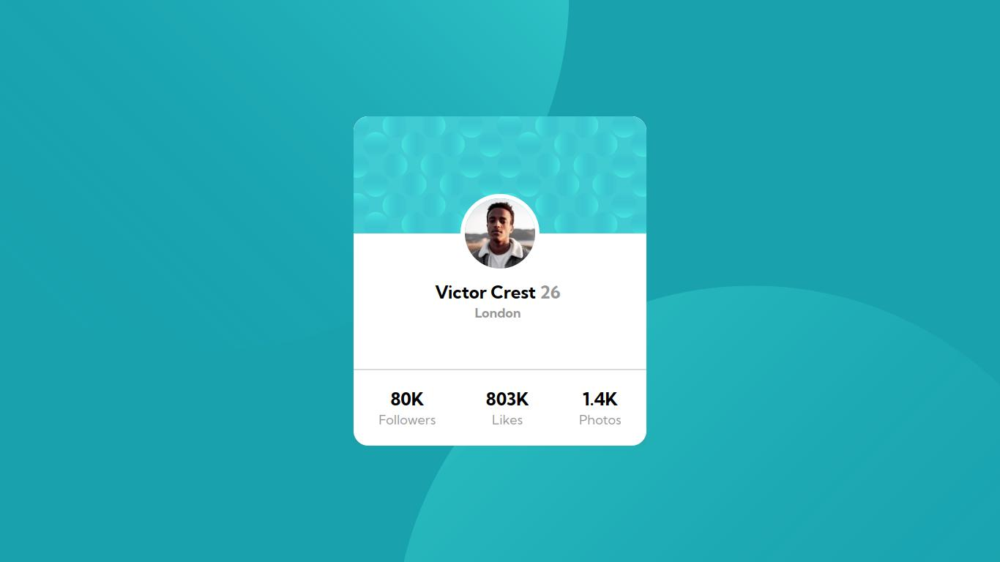

# Frontend Mentor - Profile card component solution

This is a solution to the [Profile card component challenge on Frontend Mentor](https://www.frontendmentor.io/challenges/profile-card-component-cfArpWshJ). Frontend Mentor challenges help you improve your coding skills by building realistic projects. 

## Table of contents

- [Overview](#overview)
  - [The challenge](#the-challenge)
  - [Screenshot](#screenshot)
  - [Links](#links)
- [My process](#my-process)
  - [Built with](#built-with)
  - [What I learned](#what-i-learned)
- [Author](#author)

## Overview

### The challenge

- Build out the project to the designs provided

### Screenshot



### Links

- Solution URL: [Github Repo](https://github.com/PedroReves/Profile-Card)
- Live Site URL: [Live Website](https://pedroreves.github.io/Profile-Card/)

## My process

### Built with

- Semantic HTML5 markup
- CSS custom properties
- Flexbox

### What I learned

I learned more about positioning using the position property, and how to add background images using css

```css
  background: url(../images/bg-pattern-bottom.svg) bottom -600px right -150px no-repeat, url(../images/bg-pattern-top.svg) top -500px left -200px no-repeat;

```
## Author

- Frontend Mentor - [@PedroReves](https://www.frontendmentor.io/profile/PedroReves)

